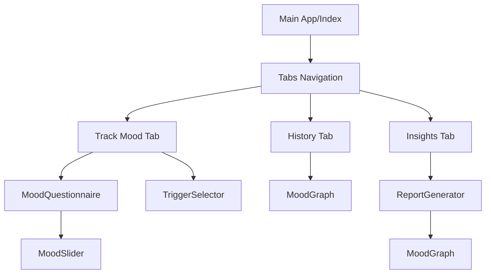

# MoodSphere Architecture Analysis

MoodSphere is a focused emotional health tracking application built with modern web technologies. This document outlines the system architecture, component hierarchy, and data flow.

## Tech Stack

- **Frontend**: [React 18](https://react.dev/) with [TypeScript](https://www.typescriptlang.org/)
- **Build Tool**: [Vite](https://vitejs.dev/)
- **Styling**: [Tailwind CSS](https://tailwindcss.com/)
- **UI Components**: [shadcn/ui](https://ui.shadcn.com/) (based on Radix UI)
- **Icons**: [Lucide React](https://lucide.dev/)
- **Data Visualization**: [Recharts](https://recharts.org/)
- **State Management**: React Hooks (`useState`, `useEffect`) + Browser `localStorage`

## Project Structure

```text
src/
├── components/          # Reusable UI components
│   ├── ui/              # shadcn base components
│   ├── MoodEmoji.tsx    # Visual mood representation
│   ├── MoodGraph.tsx    # Trend visualization using Recharts
│   ├── MoodSlider.tsx   # Input component for ratings
│   ├── ...              # Other feature components
├── hooks/               # Custom React hooks
├── lib/                 # Utility functions (shadcn/tailwind)
├── pages/               # Top-level page components
│   └── Index.tsx        # Main application dashboard
├── types.ts             # TypeScript interfaces for data
└── main.tsx             # Application entry point
```

## Core Components & Hierarchy



## Data Persistence

MoodSphere follows a **Serverless/Local-First** approach:
1. **Source of Truth**: `localStorage` (key: `moodEntries`).
2. **Synchronization**: Data is synced to `localStorage` on every update via the `Index.tsx` useEffect hook.
3. **Data Format**: `MoodEntry` interface containing date, questionnaire answers, overall score, and triggers.

## Key Workflows

### 1. Mood Tracking
- User answers 5 questions on a scale of 1-10.
- Triggers are optionally selected.
- `overallScore` is calculated as a simple average.
- Entry is pushed to state and persisted.

### 2. Report Generation
- `ReportGenerator` analyzes the entry history.
- Performs frequency analysis on triggers.
- Calculates mood trends (improving/declining) based on rolling averages.
- Generates a text-based summary for download or therapist sharing.
